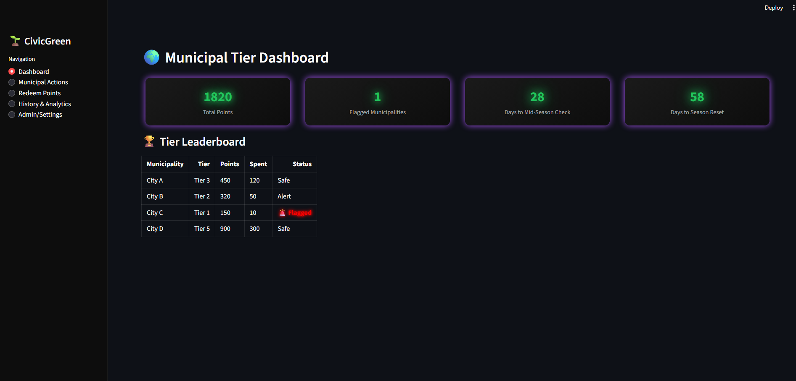
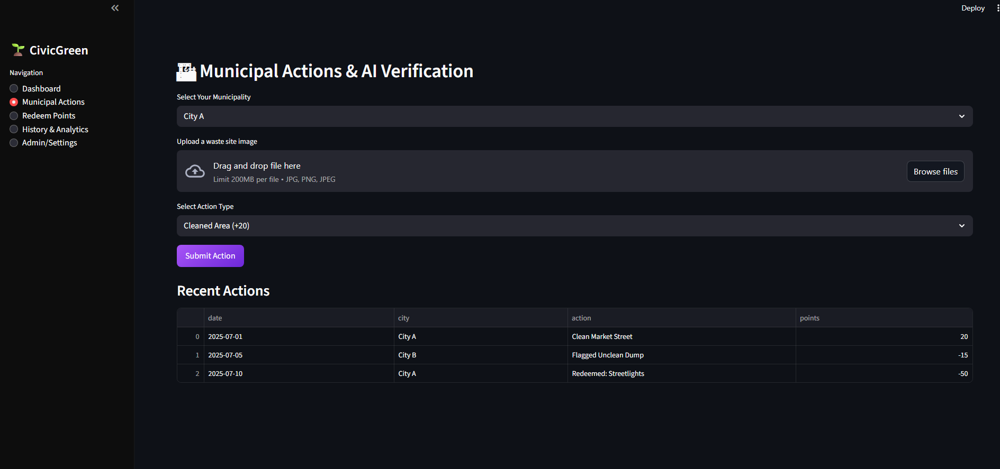
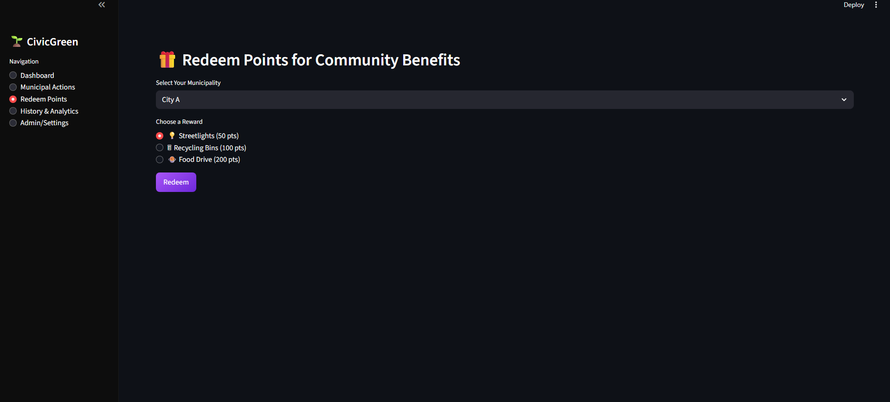
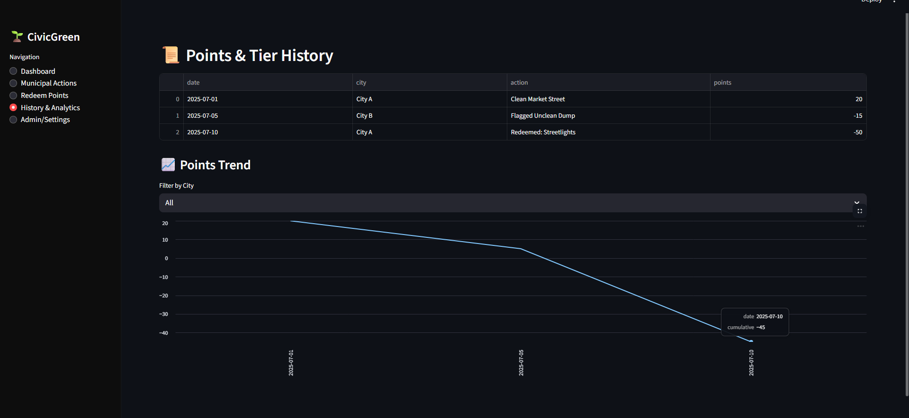
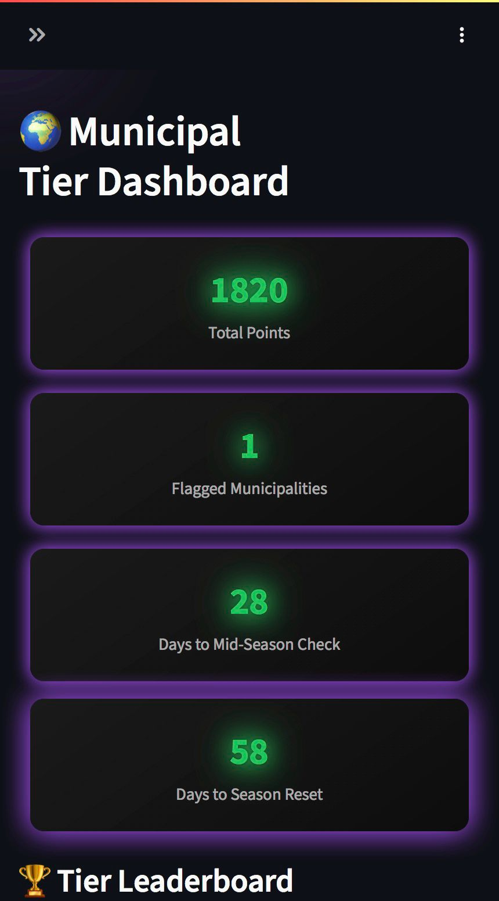
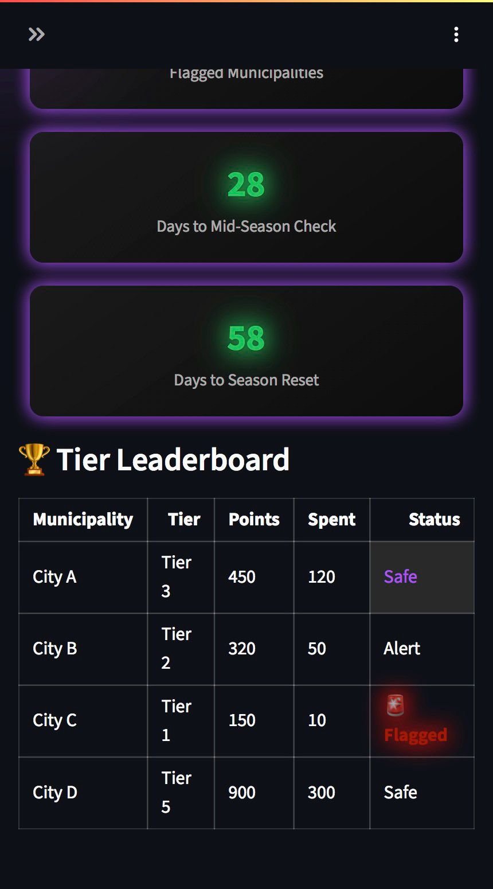
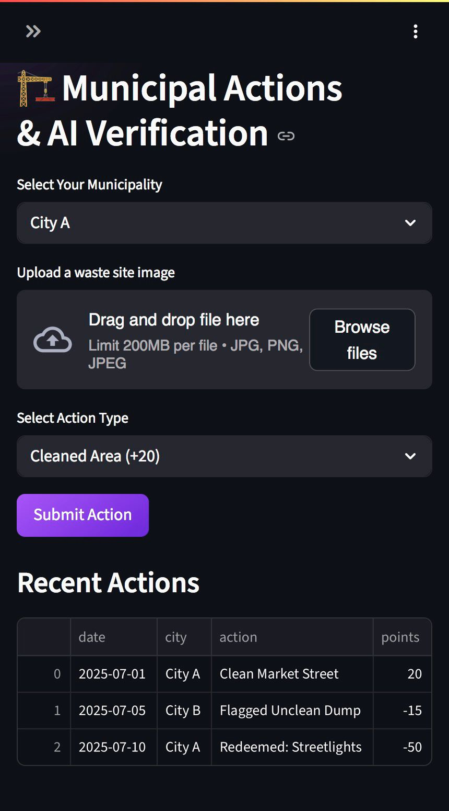
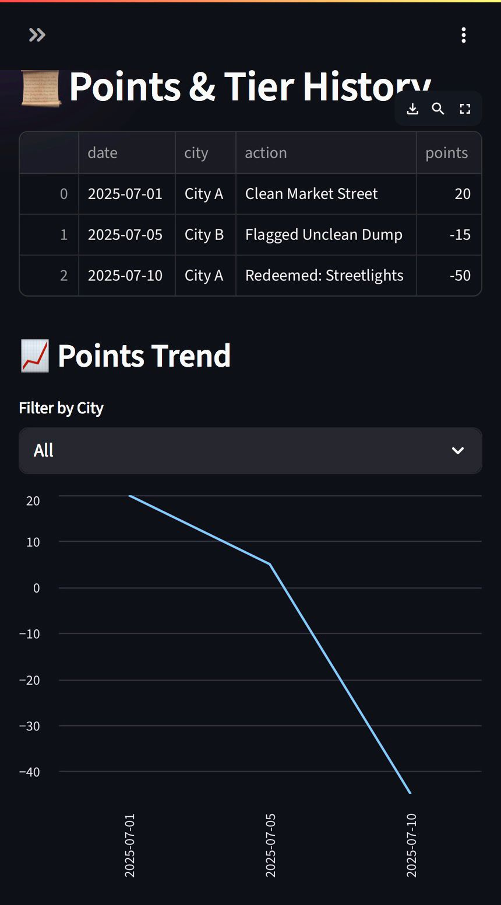

# 🚀 Green Spark Submission

## Project Title
CivicGreen – Gamified Municipal Sustainability Dashboard

## Problem Statement Addressed
"How might we build and deploy technology-driven solutions that actively promote cleaner, greener communities and environmental sustainability?"

## Project Overview
CivicGreen is a gamified municipal dashboard that promotes eco-awareness and sustainable community actions.

- Municipalities **earn points** for completing eco-friendly activities such as waste collection, recycling drives, and maintaining public cleanliness.
- **Negligent municipalities are flagged** with **blinking alerts and mock social media posts**, ensuring public accountability.
- Municipalities can **redeem earned points** for community benefits such as streetlights, recycling bins, and community food drives.
- The system **motivates competition and engagement** through a **tiered leaderboard (1–5)** and a **fully animated interactive UI**.

**Who Benefits?**  
- Municipalities gain structured feedback and rewards for sustainability.  
- Citizens benefit from cleaner neighborhoods and improved community facilities.  

---

## Key Features
- 🌱 **Tier Leaderboard (1–5)** for municipalities with live point updates  
- 🚨 **Blinking & pulsing flag alerts** for underperforming municipalities  
- 🎁 **Reward redemption system** to reinvest points into community initiatives  
- ⚡ **Animated neon UI** with hover effects and purple cursor glow  
- 📊 **History & analytics dashboard** with points trend and activity log  
- 📱 **Mobile and desktop responsive interface** with visual consistency  

---

## GitHub Repository Link
[https://github.com/zyrus-sky/CivicGreen](https://github.com/zyrus-sky/CivicGreen)
## demo Link(Features limited cuz it developed with limited amount of time)
[https://civicgreen-ffs.streamlit.app/] (https://civicgreen-ffs.streamlit.app/)
---

## Team Members & Roles
- **Sree Krishna A** – Frontend Development & UI/UX Design  
- **Aswin Raj H** – Logic, Gamification System & Integration  
- **Niranjan Babu J** – Testing, Documentation & Deployment  

---

## Screenshots

### 🖥 Desktop UI

### 📱 Mobile UI

*(All screenshots are stored in `/assets` folder.)*

---

### Additional Notes
**Challenges Faced**  
- Implementing smooth animations and hover effects in Streamlit within limited time.  
- Designing a **gamified interface** that is both **informative and visually engaging**.  

**Tech Stack**
- **Frontend:** Python + Streamlit  
- **UI:** HTML/CSS Animations (neon glow, hover & blinking alerts)  
- **Data:** In-memory session state for hackathon demo  
- **Analytics:** Pandas + Streamlit line charts  
- **Hosting:** Streamlit Community Cloud or Local Demo  

**Future Plans**
- 🤖 **AI-powered waste image verification** using sklearn  
- 🌐 **Web3-based eco-credit system** for verified green actions  
- 📱 **Responsive mobile-first redesign** for broader community access  

